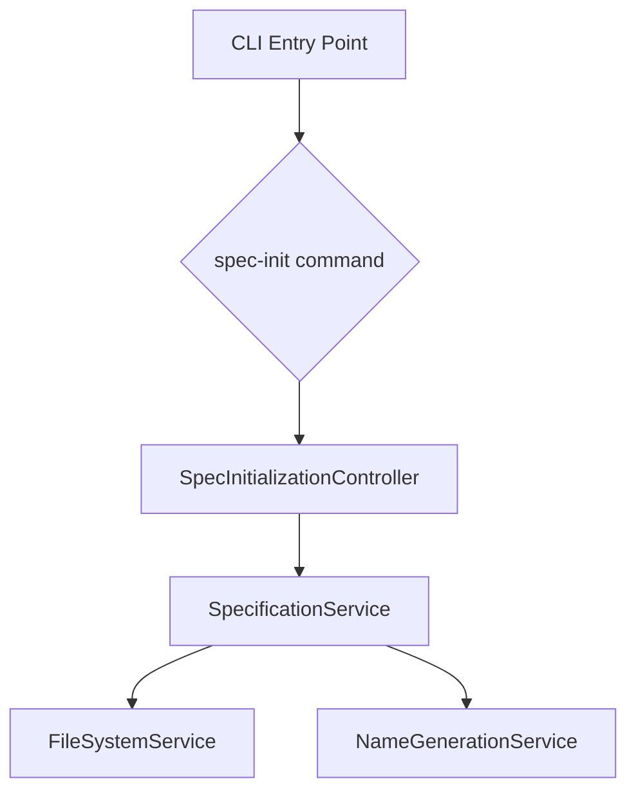
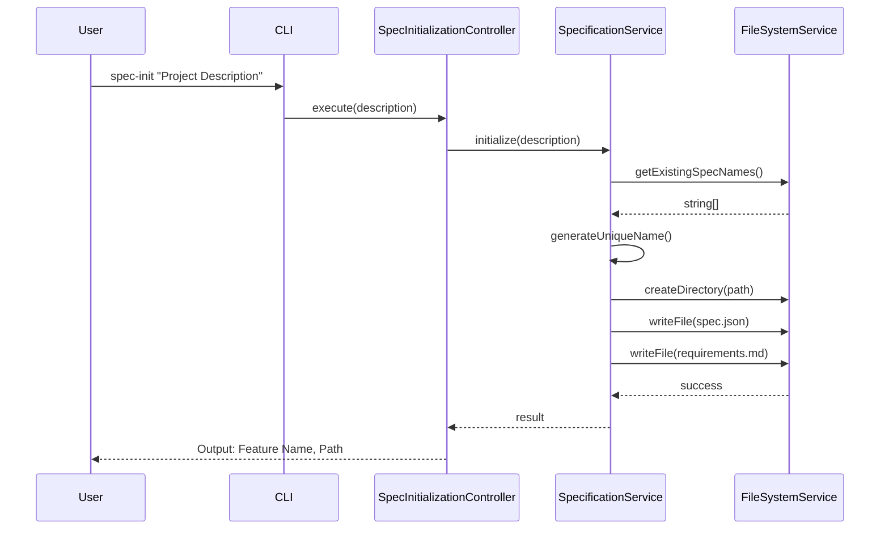

## 概要

**目的**: 本機能は、プロジェクト説明文から新しい仕様の初期構造を生成する `spec-init` コマンドをKiro CLIに提供します。
**ユーザー**: 開発者は、仕様駆動開発ワークフローを迅速に開始するために本機能を利用します。
**インパクト**: このコマンドは、規約に基づいたディレクトリとメタデータファイルを自動で作成することにより、手作業によるセットアップエラーを削減し、開発プロセスを標準化します。

### ゴール

- プロジェクト説明文から、URLフレンドリーで一意な機能名を生成する。
- 仕様用のディレクトリ構造、メタデータファイル (`spec.json`)、および要求仕様書テンプレート (`requirements.md`) を自動生成する。
- コマンドの実行結果として、生成された機能名とファイルパスを明確にユーザーに通知する。

### 非ゴール

- `design.md` や `tasks.md` など、後続フェーズのファイルを生成すること。
- 既存の仕様を更新または変更すること。

## アーキテクチャ

### 高レベルアーキテクチャ

本機能は、既存のCLIアーキテクチャ内に新しいコマンドとして統合されます。関心事を分離するため、コマンドロジック、ビジネスロジック、およびファイルシステム操作をそれぞれ別のコンポーネントに分割します。



### 技術スタックと設計判断

本機能は、既存のプロジェクト技術スタックであるTypeScriptおよびNode.jsに準拠します。新しい外部ライブラリの追加は不要です。

**主要な設計判断**:

- **判断**: ファイルシステム操作をドメインロジックから分離し、専用の `FileSystemService` にカプセル化する。
- **コンテキスト**: ファイルシステムの直接操作は、コードのテスト容易性を著しく低下させます。ビジネスロジックがファイルI/Oに密結合すると、ユニットテストでモック化するのが困難になります。
- **代替案**:
    1. コントローラ内で直接 `fs` モジュールを使用する: 最も迅速だが、テストと再利用が困難。
    2. ビジネスサービス内で `fs` を使用する: ロジックは集中するが、依然としてテストが難しい。
- **選択したアプローチ**: `FileSystemService` という薄いラッパーを作成し、すべてのファイルI/O（読み取り、書き込み、存在確認）をこのサービス経由で行います。ビジネスロジック（`SpecificationService`）は、このサービスに依存します。
- **理論的根拠**: このアプローチにより、`SpecificationService` のユニットテストが容易になります。テスト時には `FileSystemService` をモック実装に差し替えるだけで、実際のファイルシステムに触れることなくロジックを検証できます。
- **トレードオフ**: わずかにコード量が増加しますが、テスト容易性、保守性、および再利用性が大幅に向上します。

## システムフロー

`spec-init` コマンド実行時のシーケンスを以下に示します。



## 要求トレーサビリティ

| 要求 | 要求概要 | コンポーネント | インターフェース |
|---|---|---|---|
| 1.1-1.5 | コマンド実行によるファイル生成 | SpecInitializationController, SpecificationService | `initialize()` |
| 2.1, 2.2 | 一意な機能名の生成 | SpecificationService, NameGenerationService | `generateUniqueName()` |
| 3.1-3.3 | `spec.json` の初期化 | SpecificationService | `initialize()` |
| 4.1, 4.2 | `requirements.md` の生成 | SpecificationService | `initialize()` |

## コンポーネントとインターフェース

### Application Layer

#### SpecInitializationController

**責務**: CLIからの入力を受け取り、`SpecificationService` を呼び出し、結果をユーザーに出力する。
**依存関係**: `SpecificationService`

### Domain Layer

#### SpecificationService

**責務**: 仕様初期化のビジネスロジック全体を調整する。機能名生成、ディレクトリ作成、ファイル生成のオーケストレーションを行う。
**依存関係**: `FileSystemService`, `NameGenerationService`
**インターフェース定義**:

```typescript
interface SpecificationService {
  initialize(projectDescription: string): Promise<Result<{ featureName: string; specPath: string; }, Error>>;
}
```

#### NameGenerationService

**責務**: テキストからスラッグを生成し、既存の名前リストと照合して一意性を保証する。
**依存関係**: なし
**インターフェース定義**:

```typescript
interface NameGenerationService {
  generateUniqueName(text: string, existingNames: string[]): string;
}
```

### Infrastructure Layer

#### FileSystemService

**責務**: ファイルシステムの読み書き操作を抽象化する。
**依存関係**: `fs/promises` (Node.js)
**インターフェース定義**:

```typescript
interface FileSystemService {
  getExistingSpecNames(path: string): Promise<string[]>;
  createDirectory(path: string): Promise<Result<void, Error>>;
  writeFile(path: string, content: string): Promise<Result<void, Error>>;
}
```

## データモデル

### Spec (spec.json)

`spec.json` ファイルのデータ構造を定義します。

```typescript
interface Spec {
  feature_name: string;
  created_at: string; // ISO 8601
  updated_at: string; // ISO 8601
  language: 'ja' | 'en';
  phase: 'initialized' | 'requirements-generated' | 'design-generated' | 'tasks-generated';
  approvals: {
    requirements: ApprovalState;
    design: ApprovalState;
    tasks: ApprovalState;
  };
  ready_for_implementation: boolean;
}

interface ApprovalState {
  generated: boolean;
  approved: boolean;
}
```

## エラーハンドリング

| エラーカテゴリ | 具体例 | レスポンス |
|---|---|---|
| ユーザーエラー | プロジェクト説明文が未指定 | エラーメッセージを表示し、コマンドを終了する。 |
| システムエラー | ファイル書き込み権限なし | エラーメッセージ（`EACCES`など）をラップして表示し、コマンドを終了する。 |
| ビジネスロジックエラー | 生成されたディレクトリが既に存在する | 内部でリネーム処理（サフィックス追加）を行うため、通常は発生しない。万一競合した場合はエラー終了。 |

## テスト戦略

- **ユニットテスト**:
  - `NameGenerationService`: スラッグ生成ロジックと、名前の衝突時のサフィックス追加ロジックをテストする。
  - `SpecificationService`: `FileSystemService` をモック化し、正しい順序でメソッドが呼び出されることを検証する。
  - `SpecInitializationController`: サービスが返す結果に基づき、正しい出力が生成されることを検証する。
- **インテグレーションテスト**:
  - `spec-init` コマンドを実際に実行し、期待されるディレクトリとファイルが正しい内容で生成されることを確認する（テスト用のtmpディレクトリ内で実行）。
