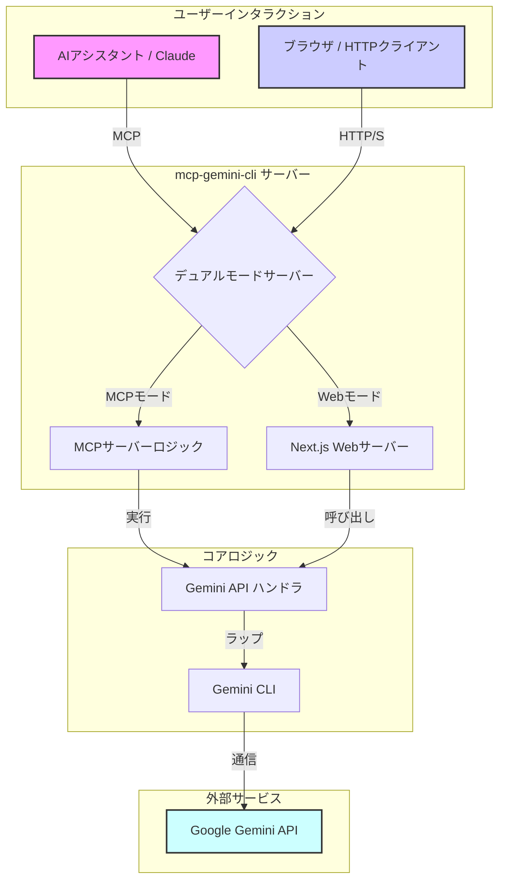

# MCP Gemini CLI

Google Gemini CLI のシンプルな MCP サーバーラッパーで、AI アシスタントが Model Context Protocol を通じて Gemini の機能を使用できるようにします。

## 機能

このサーバーは Gemini CLI と連携する以下のツールを提供します：

- `googleSearch`: Gemini を使用して Google 検索を実行
- `geminiChat`: Gemini との直接的な会話

## アーキテクチャ

このプロジェクトは、MCPサーバー（AIアシスタント用）と、UIおよびAPIを備えた標準的なWebサーバーという2つの異なるモードで動作します。



- **MCPサーバーモード**: AIアシスタント（例：Claude）がMCPサーバーにリクエストを送信し、それがコアのGemini APIハンドラによって処理されます。
- **Web API / UIモード**: ユーザーはNext.jsで動作するWebインターフェースを操作したり、APIエンドポイントにリクエストを送信したりできます。Next.jsサーバーがこれらのリクエストを処理し、同じコアAPIハンドラを利用します。
- **コアロジック**: 両方のモードで、Gemini CLIと対話するための同じ基盤ロジックを共有しており、一貫した動作を保証します。

## 前提条件

- [Gemini CLI](https://github.com/google-gemini/gemini-cli) のインストールと設定 (--allow-npx フラグ使用時は任意)

## 🚀 Claude Code でのクイックスタート

### 1. MCP サーバーの追加

```bash
claude mcp add -s project gemini-cli -- npx @nobu007/mcp-gemini-cli --allow-npx
```

または、以下のインストールオプションのセクションに示されている設定で MCP クライアントを設定してください。

### 2. 試してみる

プロンプト例：

- **検索**: "Google を使って最新の TypeScript 5.0 機能を検索して"
- **チャット**: "Gemini に JavaScript の async/await と promises の違いを説明してもらって"

## 🌐 Web インターフェース (NEW!)

### Web UI モードで起動

```bash
npm run web:dev
```

`http://localhost:3000` でブラウザから直接 Gemini CLI を使用できます。

## APIリファレンス

このサーバーは、Geminiサービスと対話するためのRESTful APIエンドポイントを提供します。

### Google検索

- **エンドポイント**: `/api/google-search`
- **メソッド**: `POST`, `GET`
- **説明**: Geminiを使用してGoogle検索を実行します。

**POSTリクエストボディ (JSON):**

| パラメータ | 型 | 必須 | 説明 |
|---|---|---|---|
| `query` | string | はい | 検索クエリ。 |
| `limit` | number | いいえ | 最大結果数。 |
| `raw` | boolean | いいえ | `true`の場合、構造化されたJSON結果を返します。 |
| `sandbox` | boolean | いいえ | サンドボックスモードで実行します。 |
| `yolo` | boolean | いいえ | 確認プロンプトをスキップします。 |
| `model` | string | いいえ | 使用するGeminiモデル (例: "gemini-2.5-pro")。 |

**GETクエリパラメータ:**

`POST`の全パラメータは、`GET`リクエストのクエリパラメータとして使用できます。

**使用例 (cURL):**

```bash
curl -X POST http://localhost:3000/api/google-search \
  -H "Content-Type: application/json" \
  -d '{"query": "TypeScript ベストプラクティス", "limit": 5}'
```

### Geminiチャット

- **エンドポイント**: `/api/gemini-chat`
- **メソッド**: `POST`, `GET`
- **説明**: Geminiと直接対話します。

**POSTリクエストボディ (JSON):**

| パラメータ | 型 | 必須 | 説明 |
|---|---|---|---|
| `prompt` | string | はい | Geminiに送信するプロンプト。 |
| `sandbox` | boolean | いいえ | サンドボックスモードで実行します。 |
| `yolo` | boolean | いいえ | 確認プロンプトをスキップします。 |
| `model` | string | いいえ | 使用するGeminiモデル (例: "gemini-2.5-pro")。 |

**GETクエリパラメータ:**

`POST`の全パラメータは、`GET`リクエストのクエリパラメータとして使用できます。

**使用例 (cURL):**

```bash
curl -X POST http://localhost:3000/api/gemini-chat \
  -H "Content-Type: application/json" \
  -d '{"prompt": "量子コンピューティングを簡単に説明して"}'
```

## 🔧 インストールオプション

### npx と --allow-npx フラグを使用

```json
{
  "mcpServers": {
    "mcp-gemini-cli": {
      "command": "npx",
      "args": ["@nobu007/mcp-gemini-cli", "--allow-npx"]
    }
  }
}
```

### ローカル開発

1. クローンとインストール：

    ```bash
    git clone https://github.com/nobu007/mcp-gemini-cli
    cd mcp-gemini-cli
    npm install
    ```

2. Claude Desktop 設定に追加：

    ```json
    {
      "mcpServers": {
        "mcp-gemini-cli": {
          "command": "node",
          "args": ["dist/cli.js"]
        }
      }
    }
    ```

## 🛠️ 利用可能なツール

### 1. googleSearch

Gemini CLI を使用して Google 検索を実行します。

**パラメータ:**

- `query` (必須): 検索クエリ
- `limit` (任意): 最大結果数
- `raw` (任意): 構造化された結果を返す
- `sandbox` (任意): サンドボックスモードで実行
- `yolo` (任意): 確認をスキップ
- `model` (任意): 使用する Gemini モデル (デフォルト: "gemini-2.5-pro")
- `workingDirectory` (任意): gemini-cli 実行用の作業ディレクトリパス

### 2. geminiChat

Gemini との会話を行います。

**パラメータ:**

- `prompt` (必須): 会話プロンプト
- `sandbox` (任意): サンドボックスモードで実行
- `yolo` (任意): 確認をスキップ
- `model` (任意): 使用する Gemini モデル (デフォルト: "gemini-2.5-pro")
- `workingDirectory` (任意): gemini-cli 実行用の作業ディレクトリパス

## 💡 プロンプト例

mcp-gemini-cli の動作を確認するために、以下のプロンプトを試してみてください：

- **検索**: "Google を使って最新の TypeScript 5.0 機能を検索して"
- **チャット**: "Gemini に JavaScript の async/await と promises の違いを説明してもらって"

## 🛠️ 使用例

### googleSearch

```typescript
// シンプルな検索
googleSearch({ query: "最新のAIニュース" });

// 制限付き検索
googleSearch({
  query: "TypeScript ベストプラクティス",
  limit: 5,
});

// 構造化された結果
googleSearch({
  query: "React 最新機能",
  raw: true,
  limit: 3,
});

// 特定の作業ディレクトリで検索
googleSearch({
  query: "このコードベースのアーキテクチャを分析して",
  workingDirectory: "/path/to/project",
});
```

### geminiChat

```typescript
// シンプルなチャット
geminiChat({ prompt: "量子コンピューティングを簡単な言葉で説明して" });

// 別のモデルを使用
geminiChat({
  prompt: "プログラミングについての俳句を書いて",
  model: "gemini-2.5-flash",
});

// 特定の作業ディレクトリでチャット
geminiChat({
  prompt: "このプロジェクトの main.js ファイルをレビューして",
  workingDirectory: "/path/to/project",
});
```

## ⚙️ 設定

### 環境変数

環境変数を使用してタイムアウト値を設定できます：

```bash
# 全ての操作のデフォルトタイムアウト（デフォルト: 60秒）
export GEMINI_CLI_TIMEOUT_MS=120000

# Google検索操作専用のタイムアウト（デフォルト: 30秒）
export GEMINI_CLI_SEARCH_TIMEOUT_MS=45000

# gemini-cli 実行用のデフォルト作業ディレクトリ
export GEMINI_CLI_WORKING_DIR=/path/to/your/project
```

## 📝 開発

> **注意**: 開発には [Node.js](https://nodejs.org) または [Bun](https://bun.sh) ランタイムが必要です。

### MCP サーバーモードで実行

```bash
npm run dev
```

### Web 開発モードで実行

```bash
npm run web:dev
```

### テスト実行

```bash
npm test
```

### プロダクション用ビルド

```bash
# 開発ビルド
npm run build

# プロダクションビルド (最小化)
npm run build:prod

# Web アプリケーションビルド
npm run web:build
```

### リンティングとフォーマット

```bash
# コードのリント
npm run lint

# コードのフォーマット
npm run format
```

## 🎯 デュアルモード機能

このプロジェクトは 2 つのモードで動作します：

1. **MCP Server モード**: Claude などの AI アシスタントとの統合用
2. **Web API モード**: ブラウザや HTTP クライアントからの直接アクセス用

### 利用シーン

- **MCP モード**: Claude Code、Claude Desktop での統合
- **Web モード**: カスタムアプリケーション、API 統合、ブラウザでのテスト

## 🤝 貢献

コントリビューションを歓迎します！プルリクエストをお気軽に提出してください。

## 📄 ライセンス

このプロジェクトは MIT ライセンスの下でライセンスされています - 詳細は LICENSE ファイルを参照してください。

## 🔗 関連リンク

- [Model Context Protocol (MCP)](https://modelcontextprotocol.io/)
- [Gemini CLI](https://github.com/google-gemini/gemini-cli)
- [Next.js](https://nextjs.org/)
- [Node.js](https://nodejs.org/)
