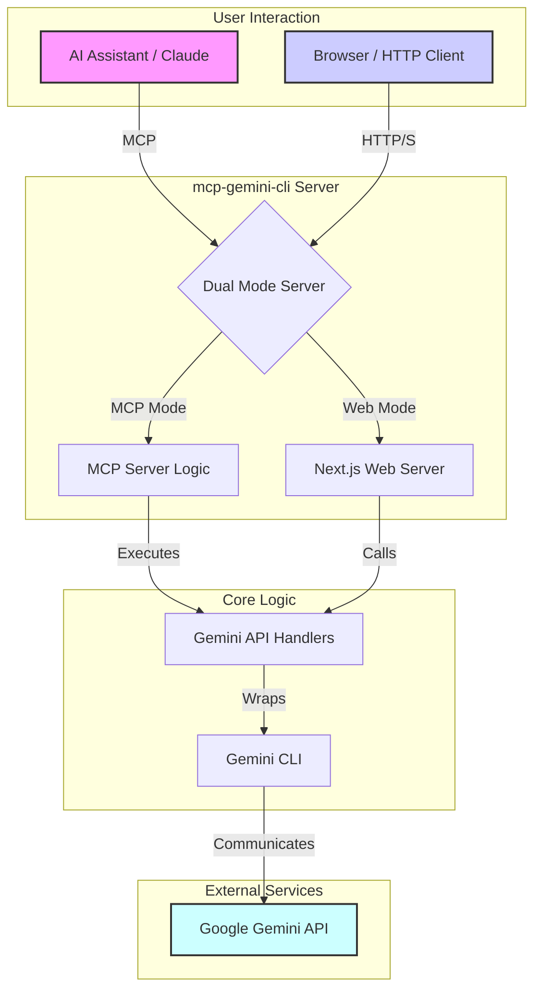

# MCP Gemini CLI

A simple MCP server wrapper for Google's Gemini CLI, enabling AI assistants to use Gemini's capabilities through the Model Context Protocol.

## Features

This server provides the following tools that integrate with the Gemini CLI:

- `googleSearch`: Perform Google searches using Gemini
- `geminiChat`: Direct conversation with Gemini

## Architecture

This project runs in two distinct modes: as an MCP server for AI assistants and as a standard web server with a UI and API.



- **MCP Server Mode**: An AI assistant (e.g., Claude) sends requests to the MCP server, which are processed by the core Gemini API handlers.
- **Web API / UI Mode**: Users can interact with a Next.js-powered web interface or send requests to the API endpoints. The Next.js server handles these requests, utilizing the same core API handlers.
- **Core Logic**: Both modes share the same underlying logic for interacting with the Gemini CLI, ensuring consistent behavior.

## Prerequisites

- [Gemini CLI](https://github.com/google-gemini/gemini-cli) installation and configuration (optional when using --allow-npx flag)

## 🚀 Quick Start with Claude Code

### 1. Add MCP Server

```bash
claude mcp add -s project gemini-cli -- npx @nobu007/mcp-gemini-cli --allow-npx
```

Or configure your MCP client with the settings shown in the Installation Options section below.

### 2. Try It Out

Example prompts:

- **Search**: "Use Google to search for the latest TypeScript 5.0 features"
- **Chat**: "Ask Gemini to explain the difference between JavaScript async/await and promises"

## 🌐 Web Interface (NEW!)

### Launch Web UI Mode

```bash
npm run web:dev
```

Access the Gemini CLI directly from your browser at `http://localhost:3000`.

## API Reference

The server provides RESTful API endpoints for interacting with Gemini services.

### Google Search

- **Endpoint**: `/api/google-search`
- **Method**: `POST`, `GET`
- **Description**: Performs a Google search using Gemini.

**POST Request Body (JSON):**

| Parameter | Type | Required | Description |
|---|---|---|---|
| `query` | string | Yes | The search query. |
| `limit` | number | No | Maximum number of results. |
| `raw` | boolean | No | If `true`, returns structured JSON results. |
| `sandbox` | boolean | No | Run in sandbox mode. |
| `yolo` | boolean | No | Skip confirmation prompts. |
| `model` | string | No | Gemini model to use (e.g., "gemini-2.5-pro"). |

**GET Query Parameters:**

All `POST` parameters can be used as query parameters for `GET` requests.

**Example (cURL):**

```bash
curl -X POST http://localhost:3000/api/google-search \
  -H "Content-Type: application/json" \
  -d '{"query": "TypeScript best practices", "limit": 5}'
```

### Gemini Chat

- **Endpoint**: `/api/gemini-chat`
- **Method**: `POST`, `GET`
- **Description**: Engages in a direct conversation with Gemini.

**POST Request Body (JSON):**

| Parameter | Type | Required | Description |
|---|---|---|---|
| `prompt` | string | Yes | The prompt to send to Gemini. |
| `sandbox` | boolean | No | Run in sandbox mode. |
| `yolo` | boolean | No | Skip confirmation prompts. |
| `model` | string | No | Gemini model to use (e.g., "gemini-2.5-pro"). |

**GET Query Parameters:**

All `POST` parameters can be used as query parameters for `GET` requests.

**Example (cURL):**

```bash
curl -X POST http://localhost:3000/api/gemini-chat \
  -H "Content-Type: application/json" \
  -d '{"prompt": "Explain quantum computing in simple terms"}'
```

## 🔧 Installation Options

### Using npx with --allow-npx flag

```json
{
  "mcpServers": {
    "mcp-gemini-cli": {
      "command": "npx",
      "args": ["@nobu007/mcp-gemini-cli", "--allow-npx"]
    }
  }
}
```

### Local Development

1. Clone and install:

    ```bash
    git clone https://github.com/nobu007/mcp-gemini-cli
    cd mcp-gemini-cli
    npm install
    ```

2. Add to Claude Desktop configuration:

    ```json
    {
      "mcpServers": {
        "mcp-gemini-cli": {
          "command": "node",
          "args": ["dist/cli.js"]
        }
      }
    }
    ```

## 🛠️ Available Tools

### 1. googleSearch

Perform Google searches using the Gemini CLI.

**Parameters:**

- `query` (required): Search query
- `limit` (optional): Maximum number of results
- `raw` (optional): Return structured results
- `sandbox` (optional): Run in sandbox mode
- `yolo` (optional): Skip confirmation
- `model` (optional): Gemini model to use (default: "gemini-2.5-pro")
- `workingDirectory` (optional): Working directory path for gemini-cli execution

### 2. geminiChat

Converse with Gemini.

**Parameters:**

- `prompt` (required): Conversation prompt
- `sandbox` (optional): Run in sandbox mode
- `yolo` (optional): Skip confirmation
- `model` (optional): Gemini model to use (default: "gemini-2.5-pro")
- `workingDirectory` (optional): Working directory path for gemini-cli execution

## 💡 Example Prompts

Try these prompts to test mcp-gemini-cli functionality:

- **Search**: "Use Google to search for the latest TypeScript 5.0 features"
- **Chat**: "Ask Gemini to explain the difference between JavaScript async/await and promises"

## 🛠️ Usage Examples

### googleSearch

```typescript
// Simple search
googleSearch({ query: "latest AI news" });

// Limited search
googleSearch({
  query: "TypeScript best practices",
  limit: 5,
});

// Structured results
googleSearch({
  query: "React latest features",
  raw: true,
  limit: 3,
});

// Search with specific working directory
googleSearch({
  query: "analyze this codebase architecture",
  workingDirectory: "/path/to/project",
});
```

### geminiChat

```typescript
// Simple chat
geminiChat({ prompt: "Explain quantum computing in simple terms" });

// Using a different model
geminiChat({
  prompt: "Write a haiku about programming",
  model: "gemini-2.5-flash",
});

// Chat with specific working directory
geminiChat({
  prompt: "Review the main.js file in this project",
  workingDirectory: "/path/to/project",
});
```

## ⚙️ Configuration

### Environment Variables

You can configure timeout values using environment variables:

```bash
# Default timeout for all operations (default: 60 seconds)
export GEMINI_CLI_TIMEOUT_MS=120000

# Timeout specifically for Google Search operations (default: 30 seconds)
export GEMINI_CLI_SEARCH_TIMEOUT_MS=45000

# Default working directory for gemini-cli execution
export GEMINI_CLI_WORKING_DIR=/path/to/your/project
```

## 📝 Development

> **Note**: Development requires [Node.js](https://nodejs.org) or [Bun](https://bun.sh) runtime.

### Run in MCP Server Mode

```bash
npm run dev
```

### Run in Web Development Mode

```bash
npm run web:dev
```

### Run Tests

```bash
npm test
```

### Production Build

```bash
# Development build
npm run build

# Production build (minified)
npm run build:prod

# Web application build
npm run web:build
```

### Linting and Formatting

```bash
# Lint code
npm run lint

# Format code
npm run format
```

## 🎯 Dual Mode Functionality

This project operates in two modes:

1. **MCP Server Mode**: For integration with AI assistants like Claude
2. **Web API Mode**: For direct access from browsers or HTTP clients

### Use Cases

- **MCP Mode**: Integration with Claude Code, Claude Desktop
- **Web Mode**: Custom applications, API integration, browser testing

## 🤝 Contributing

Contributions are welcome! Feel free to submit pull requests.

## 📄 License

This project is licensed under the MIT License - see the LICENSE file for details.

## 🔗 Related Links

- [Model Context Protocol (MCP)](https://modelcontextprotocol.io/)
- [Gemini CLI](https://github.com/google-gemini/gemini-cli)
- [Next.js](https://nextjs.org/)
- [Node.js](https://nodejs.org/)
