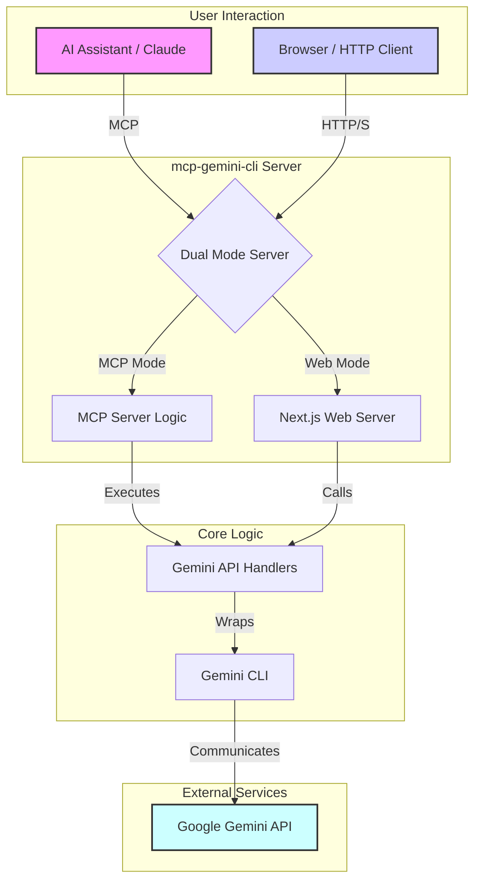

# Architecture

This project runs in two distinct modes: as an MCP server for AI assistants and as a standard web server with a UI and API.

- **MCP Server Mode**: An AI assistant (e.g., Claude) sends requests to the MCP server, which are processed by the core Gemini API handlers.
- **Web API / UI Mode**: Users can interact with a Next.js-powered web interface or send requests to the API endpoints. The Next.js server handles these requests, utilizing the same core API handlers.
- **Core Logic**: Both modes share the same underlying logic for interacting with the Gemini CLI, ensuring consistent behavior.
